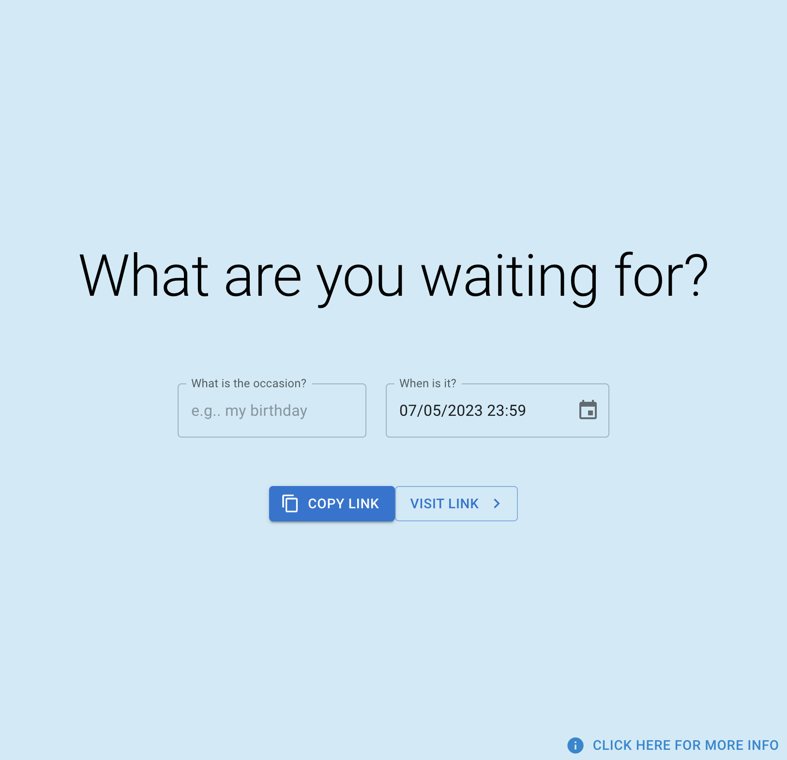
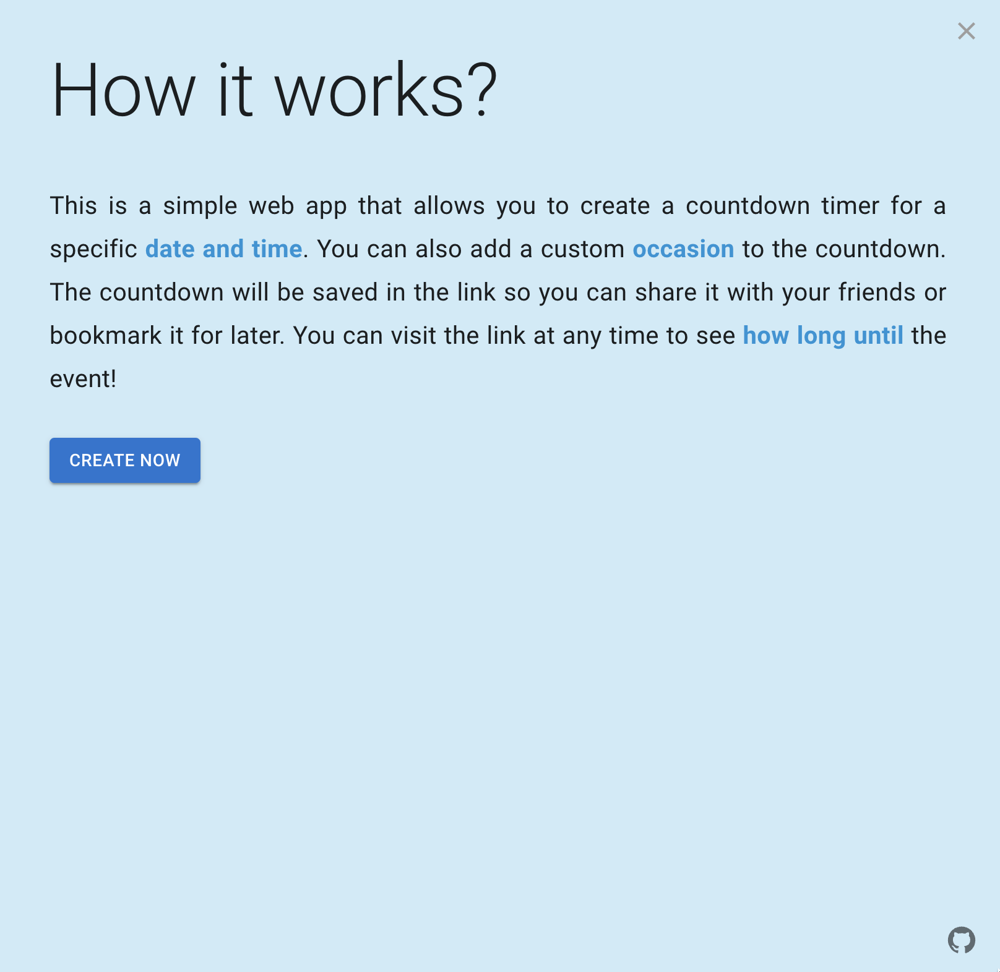
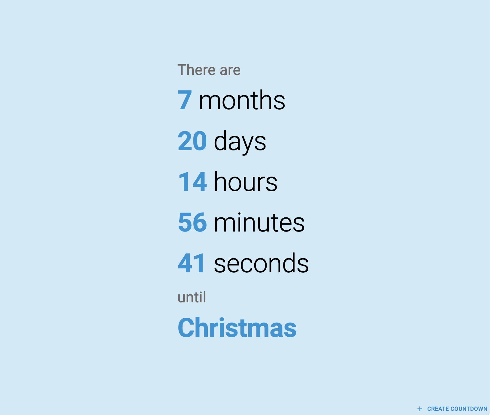

# How Long Until Web App

## Description

This web app lets you easily create URLs with a date/time and an optional occasion which will direct to a countdown
timer. It's simple, minimal, and aesthetically beautiful - perfect for sharing and bookmarking. While there
are similar websites, they seemed to be overly complicated to create, looked visually crowded, or not mobile friendly, so I decided to make my own. 

It is currently deployed at [how-long.netlify.app](https://how-long.netlify.app/).

## Development
### Getting Started

This is built using `create-react-app` and `typescript`, so to get started, simply run:

```zsh
npm start
```

### Routes

#### Home
`/` - The home page:




Contains a form to create a new countdown timer. There is a help button which will display a modal with instructions on how to use the app.

#### Until 
`/until?datetime={datetime}&occasion={occasion}` - The countdown timer page:



This page will display a countdown timer until the specified date and time. The date and time are required query parameters. The occasion is optional, and will be displayed below the countdown timer (if provided).


## Tests

The repository is set up with `jest` and `react-testing-library` so to run tests, simply run:

```zsh
npm test
```

or for live reloading

```zsh
npm run test:watch
```

## Linting
```zsh
npm run lint
```